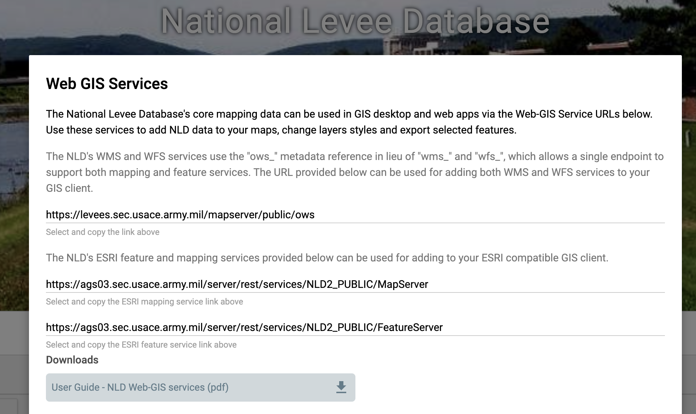

# National_Levee_Database

This notebook demonstrates how to programmatically "bulk download" core GIS data from the [National Levee Database](https://levees.sec.usace.army.mil/#/)(NLD) using [GDAL/OGR Python APIs](https://gdal.org/python/). NLD GIS data is available for public access via both ESRI ArcGIS services and OGC services. In this notebook, we focus on retrieving data from the ArcGIS [Feature Service](https://developers.arcgis.com/rest/services-reference/enterprise/feature-service.htm) REST APIs. 

The offical "User Guide - NLD Web-GIS services (pdf)" (shown in the snapshot below) provides instructions on data access using ArcMap, ArcGIS Pro and QGIS. In addition, [ArcGIS Online Map Viewer](https://www.arcgis.com/home/webmap/viewer.html) is also a good tool for quick visualization. 

OpenWith CyberGISX [Here](https://cybergisx.cigi.illinois.edu/hub/user-redirect/git-pull?repo=https%3A%2F%2Fgithub.com%2Fcybergis%2FNational_Levee_Database&urlpath=lab%2Ftree%2FNational_Levee_Database%2F1_NLD_Bulk_Download.ipynb&branch=main)
